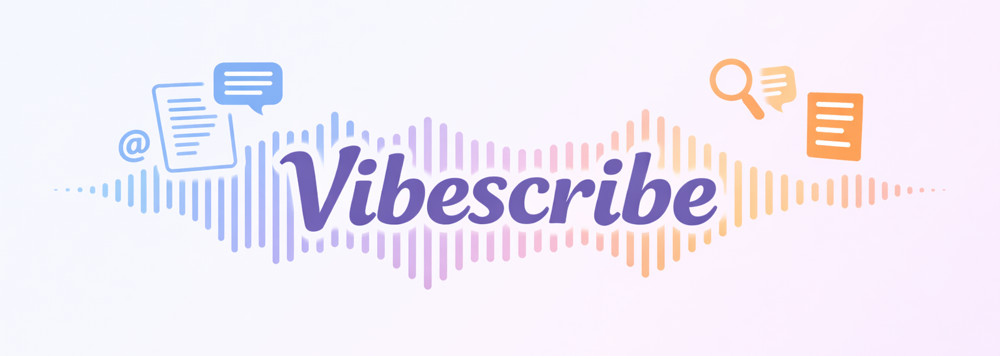

# VibeScribe



A blazing fast macOS dictation app with real-time transcription and AI-powered enhancement, powered by [Deepgram](https://deepgram.com) and [OpenRouter](https://openrouter.ai).

## Features

### Transcription
- **Real-time streaming** via Deepgram WebSocket — transcription starts as you speak
- **Multiple languages** — configure language in settings or use auto-detect
- **Auto-paste** — transcript is automatically pasted into the active app on release
- **Restore clipboard** — optionally restores your previous clipboard contents after pasting

### Hotkeys
- **Multiple shortcuts** — configure more than one hotkey, each with its own behaviour
- **Three activation modes** per shortcut: Hold (push-to-talk), Click (toggle), or Both
- **Supported keys**: Fn, Left Control, Left Command, Right Command, Right Option
- **Esc to cancel** — optionally cancel an in-progress recording with Escape

### AI Enhancement
- **LLM post-processing** via [OpenRouter](https://openrouter.ai) — works with any model (GPT-4o, Claude, Gemini, etc.)
- **Prompt library** — create and reuse named prompts (Clean up, Summarize, Translate, …)
- **Per-shortcut routing** — assign a different default prompt to each hotkey
- **Per-app overrides** — automatically switch to a different prompt based on which app is active

### Overlay & Feedback
- **Animated listening overlay** — floating pill at the top or bottom of your screen
- **Live audio waveform** — visual feedback as you speak
- **Enhancing state** — overlay transitions to a sparkle animation while the LLM processes
- **App icon in overlay** — when a per-app prompt override activates, shows the target app's icon
- **Sound effects** — optional audio cue on start and stop
- **Mute media during recording** — optionally pause other audio while you dictate

### History & Debugging
- **Transcript history** — browse the last 10 or 100 transcriptions, including enhanced versions
- **Logs tab** — real-time connection and debug logs (up to 1 000 entries)

## Requirements
- macOS 13+
- A [Deepgram API key](https://console.deepgram.com) (new accounts include ~$200 free credit)
- An [OpenRouter API key](https://openrouter.ai) (optional, only needed for AI enhancement)

## Install
Package a `.app` bundle for permanent install:
```bash
bash package_app.sh
```
This creates `VibeScribe.app` in the repo root. Move it to `/Applications`, launch it once, then add it to Login Items (System Settings → General → Login Items).

To customise the bundle name, id, or version, edit `version.env`.

## Run from source
```bash
swift run
```

## Build
```bash
swift build
```

## Test
```bash
bash scripts/test.sh
```
Requires `xcbeautify`:
```bash
brew install xcbeautify
```

## Usage
1. Launch the app — it appears in the menu bar.
2. Open the main window and enter your Deepgram API key in the General tab.
3. Use the Shortcuts tab to configure your hotkey(s) and activation mode.
4. *(Optional)* Add an OpenRouter key + model in the Enhancements tab, create prompts, and assign them to shortcuts.
5. Hold (or tap, depending on mode) your hotkey to start recording. Release (or tap again) to stop and paste.

## Permissions
- **Microphone** — required for recording.
- **Accessibility** — required for global hotkeys and auto-paste.

Both can be requested from the General tab in the app.

## Architecture
```
Sources/VibeScribeCore/
├── AppState.swift                  – central observable state
├── DeepgramClient.swift            – WebSocket streaming transcription
├── OpenRouterClient.swift          – LLM enhancement via OpenRouter
├── HotkeyListener.swift            – low-level global hotkey capture
├── ShortcutConfig.swift            – shortcut + prompt data models
├── Runtime/
│   ├── RecordingRuntime.swift      – recording lifecycle state machine
│   ├── PasteRuntime.swift          – paste + enhancement orchestration
│   └── ShortcutRuntime.swift       – hotkey event routing
└── UI/
    ├── MainView.swift              – tabbed settings window
    ├── ShortcutsSettingsView.swift – hotkey configuration
    ├── EnhancementsSettingsView.swift – prompt library + routing
    └── OverlayView.swift           – floating listening overlay
```

## Contributing
Issues and PRs are welcome.
1. Open an issue describing the change or bug.
2. Keep changes focused and avoid adding backward-compatibility logic unless needed.
3. If you add tests, include updates in the same PR and run `bash scripts/test.sh`.

## License
MIT — use, modify, and distribute freely (including commercially) as long as you keep the copyright notice. No warranty. See `LICENSE`.

## Notes
The API key is stored in `UserDefaults` in plaintext for convenience. For a production distribution, consider using the Keychain instead.
